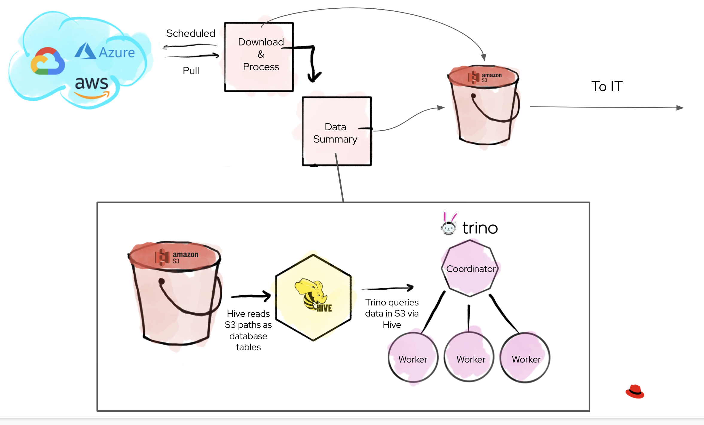

## What is Trino?

Trino is an SQL query engine, but not an SQL database. What does that mean? Traditional databases typically consist of a query engine and a storage engine. Trino is just a query engine and does not store data.

So, what does this mean for koku deveopers? To answer that question we have to start looking into koku architecture. Credit to Andrew Berglund for the diagram below:




So, inside of koku our download workers will retrieve cost data from the cloud providers in the form of CSVs. Then during processing we convert these csv files to parquet files (Look for the following function in the codebase: `convert_csv_to_parquet`). After the files are converted they are then sent up to an S3 bucket. We do this because Trino is just a query engine and does not store the data, we leave that up to S3.

Now that the parquet files are in S3, how does querying them work? (This is the S3, hive, trino coordinator & worker part of the diagram)

The worker will send the query to the [trino coordinator](https://trino.io/docs/current/overview/concepts.html#coordinator). The Trino coordinator is the server that is responsible for parsing statements, planning queries, and managing Trino worker nodes. It is the “brain” of a Trino installation and is also the node to which a client (our workers) connects to submit statements for execution. After the worker has connected it will then use hive to collect the data from the S3 buckets based off of its path.

**How is this helpful?**
Well the 5s explaination is that relieves some of the pressure on our postgres database. With the old workflow we use to do alot of aggregations to get our csv data into a `daily_summary` format. With Trino we can now move all of this processing outside of postgres relieving some of the pressure. (This is actually a really long list, but this is the TLDR version.)

**TODO: Managed Tables versus Unmanaged Tables in Trino**

Helpful Intro Links:
- https://blog.starburst.io/intro-to-trino-for-the-trinewbie


##  How to Develop with Trino Locally

#### Environment
```
#### USING TRINIO
## THESE VARS NEED TO BE UNCOMMENTED
ENABLE_PARQUET_PROCESSING=True
S3_BUCKET_NAME=koku-bucket
S3_ENDPOINT=http://kokuminio:9000
S3_ACCESS_KEY=kokuminioaccess
S3_SECRET=kokuminiosecret
S3_BUCKET_PATH=data
TRINO_DATE_STEP=31
## THESE WILL NEED TO BE COMMENTED OUT WHEN USING TRINIO
# S3_BUCKET_NAME=koku-bucket
# S3_BUCKET_PATH=data_archive
# S3_ENDPOINT=s3.us-east-1.amazonaws.com
# ENABLE_PARQUET_PROCESSING=False
```
#### Minio: how we spoof S3 buckets
Obviousy we don't develop with S3 buckets locally, so we use a tool called minio

Mino: http://127.0.0.1:9090/minio/
^ Username and password is based off these env vars:
```
S3_ACCESS_KEY=kokuminioaccess
S3_SECRET=kokuminiosecret
```

Since quering parquet files is based off of the S3 path, this is a great tool for seeing if the csv & parquet files are where you expect them.

#### The Coordinator:

Trino Coordinator UI: http://127.0.0.1:8080/ui/
- This is where you go if you want to see what queries the trino coordinator is running  and in what order.
- It is really helpful or debugging, because it will show the values of the vars we use in the template.
- This UI also collects metrics on how long the query took to run if you are looking into optimization.


If you want to connect directly to Trino and run your own queries you can:

**Trino CLI**
Docs for downloading [trino cli here](https://trino.io/docs/current/installation/cli.html).

Trino Commands:
```
trino --server localhost:8080 --catalog hive --schema acct10001 --user admin --debug
```

**Access Trino through Docker**
However, a quick trick that Ashley taught me is:
```
docker exec -it trino bash
```

## Good Trino Commands to Know
Corey showed me this one:
```
SHOW CREATE TABLE <table_name>;
```
^^ Corey: "This is good command for looking into the S3 path and parquet fies because it even includes the with statement so it shows stuff like external location."


#### Other Potentially Helpful Commands

Quicker way to bring the server down and up:
```
 make docker-trino-down-all && make docker-up-min-trino-no-build
```